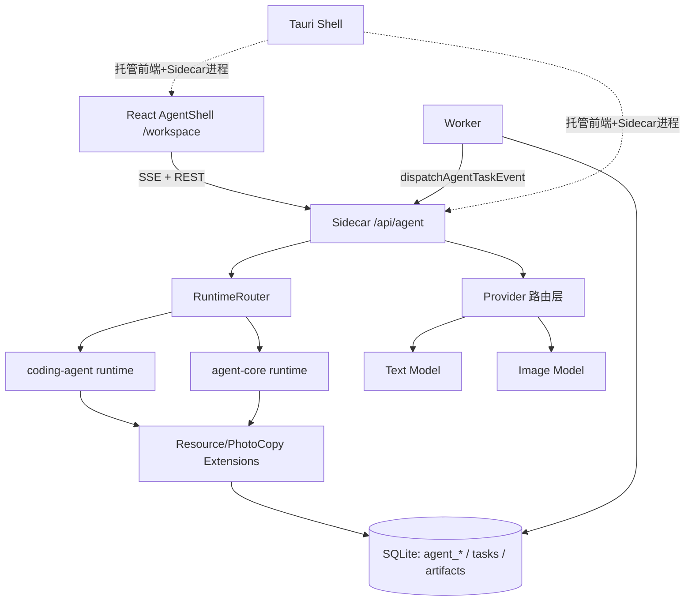
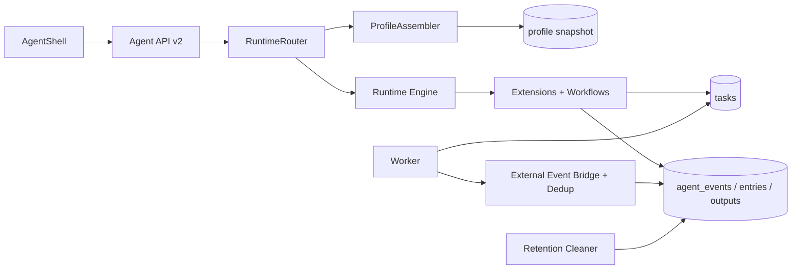
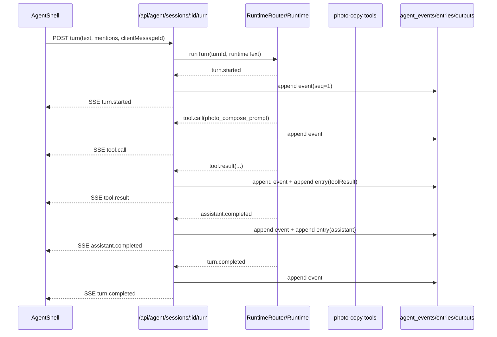
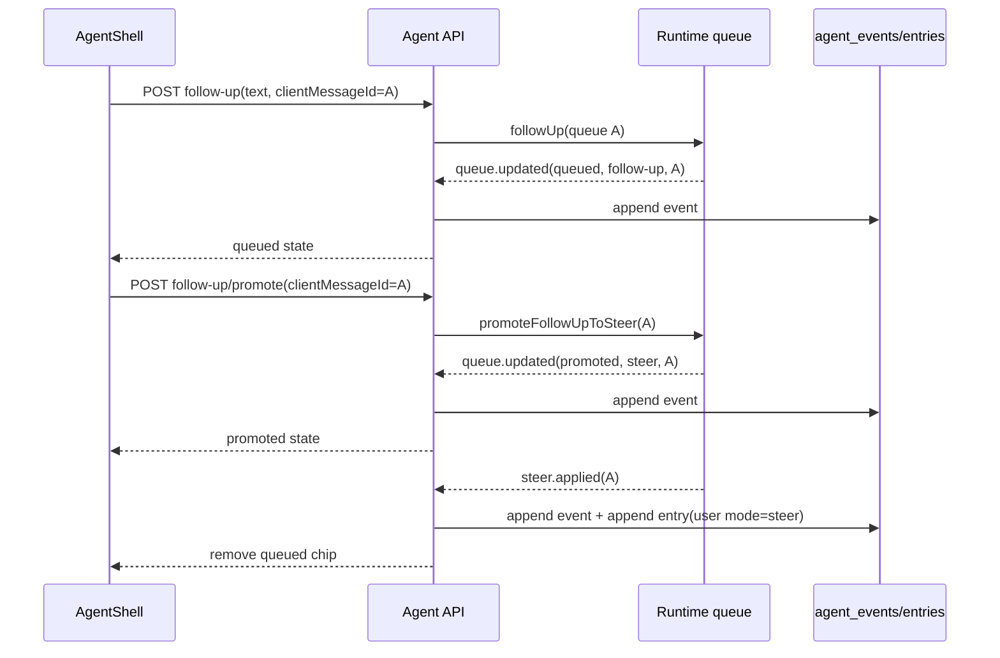
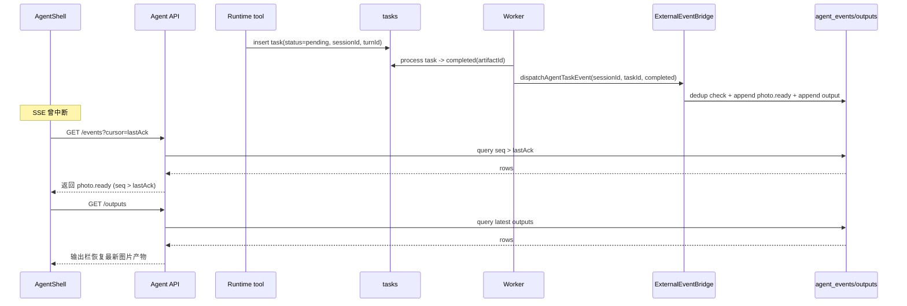

# PI Agent 全链路架构设计 v1（现状 + Phase 1 演进）

> 文档状态：可执行设计（Decision Complete）  
> 面向对象：工程实现团队  
> 基线代码时间点：2026-02-16  
> 目标范围：前端 AgentShell、Sidecar Runtime/API、Worker、DB、Provider 路由、Tauri 集成点

---

## 1. 背景与目标边界

### 1.1 背景

当前应用已经完成 PI Agent 基础落地：

- `/workspace` 作为 Agent 工作台入口（前端）。
- Sidecar 提供 `/api/agent/**` 会话、流式执行、事件回放、产物查询。
- Runtime 采用双引擎策略：`coding-agent` 优先，初始化失败 fallback 到 `agent-core`。
- 产物链路已打通：`photo`（任务队列 + worker）与 `copy`（结构化文本）。

### 1.2 目标

本设计在“现状可运行”的基础上完成 Phase 1 演进：

1. 引入会话级 `profile` 与 `workflow` 可配置能力。
2. 保持单 Agent 执行模型，但预留后续多 Agent 协作位。
3. 升级事件协议（v2）以增强可观测性与恢复能力。
4. 引入可配置 TTL 清理机制，控制事件/产物历史增长。
5. 保持文本/图片分离路由与双引擎 fallback 不变。

### 1.3 非目标（Phase 1 不做）

1. 不实现多 Agent 编排执行（仅预留协议字段）。
2. 不开放自由脚本执行或任意 bash（ScriptTool 属于后续阶段）。
3. 不替换现有 SSE + events cursor 机制。
4. 不改动上游 `@mariozechner/*` 包源码。

---

## 2. 当前实现基线（代码映射到模块）

### 2.1 分层与职责



### 2.2 关键模块映射

| 层 | 现状职责 | 关键文件 |
|---|---|---|
| 前端会话 UI | 会话管理、SSE 消费、events 轮询补偿、产物栏展示 | `src/components/agent/AgentShell.tsx` |
| 前端 API 客户端 | `/api/agent/**` 调用、SSE chunk 解析 | `src/lib/agent-api.ts` |
| 前端类型 | 会话/事件/产物/mentions 类型定义 | `src/types/agent.ts` |
| Runtime 路由 | 会话 runtime 缓存、turn gate、双引擎 fallback | `sidecar/src/agent/runtime/runtime-router.ts` |
| Runtime 实现 | turn/steer/follow-up、queue 管理、事件映射 | `sidecar/src/agent/runtime/coding-agent-runtime.ts` / `sidecar/src/agent/runtime/agent-core-runtime.ts` |
| 扩展工具 | 资源检索、文案生成、图片任务入队/状态查询 | `sidecar/src/agent/extensions/resource-extension.ts` / `sidecar/src/agent/extensions/photo-copy-extension.ts` |
| Agent API | 会话接口、SSE、events/outputs 查询、mentions 解析 | `sidecar/src/routes/agent.ts` |
| 存储服务 | session/entry/output/event 持久化 | `sidecar/src/services/agent-session-store.ts` / `sidecar/src/services/agent-event-store.ts` |
| 外部事件桥 | worker 结果回写 Agent 事件/产物 | `sidecar/src/services/agent-external-event-dispatcher.ts` |
| 异步任务执行 | image-generation 执行 + 状态更新 | `sidecar/src/worker/index.ts` |
| DB Schema | agent 与任务/产物核心表 | `sidecar/src/db/schema.ts` |

### 2.3 当前数据流摘要

1. `POST /sessions/:id/turn` -> runtime 执行 -> 事件写入 `agent_events` -> SSE 推送前端。
2. `assistant.completed` / `tool.result` 写入 `agent_entries`；`photo.ready` / `copy.ready` 写入 `agent_outputs`。
3. 前端并行使用：
   - 实时 SSE（低延迟）
   - `GET /events?cursor=` 轮询（断线补偿）
4. 图片生成通过 tasks/worker 异步完成后，经 external event bridge 回写 Agent 会话。

---

## 3. 现状问题与风险

| 主题 | 现状风险 | 影响 |
|---|---|---|
| 会话配置 | 会话无 profile 快照，技能/流程配置不可追溯 | 回放与审计难、升级时行为不稳定 |
| 事件协议 | 缺少 actor/workflow 维度 | 后续多 Agent 演进成本高 |
| 外部事件桥 | task 回写缺少强幂等约束 | 极端情况下可能重复写 event/output |
| 数据留存 | `agent_events` 长期增长，无 TTL 策略 | 本地数据库膨胀、查询变慢 |
| 类型兼容 | 前端依赖固定事件字段 | 协议升级时存在渲染风险 |
| Tauri 集成 | Sidecar 生命周期治理文档不足 | 发布诊断与恢复成本高 |

---

## 4. Phase 1 目标架构

### 4.1 核心决策

1. 执行拓扑：`单 Agent + 预留多 Agent`。
2. 路由策略：`文本/图片分离`，图片能力优先 + 回退。
3. 权限策略：默认最小权限，仅开放 profile/workflow 配置，不开放自由脚本。
4. 可观测策略：事件协议升级 v2 + 全链路可回放。
5. 数据治理：TTL 可配置清理（events/outputs）。

### 4.2 目标逻辑组件



### 4.3 Runtime 装配模型（新增）

新增 `ProfileAssembler`，会话启动时完成：

1. 读取 `profileId`（会话指定或默认 profile）。
2. 按 `agent_profiles + agent_profile_skills + agent_profile_workflows` 装配 `skills`、`workflows`、`capabilities`。
3. 生成并写入 `agent_session_profile_snapshot`。
4. runtime 仅读快照，不直接依赖可变 profile 数据。
5. 快照版本取自 `agent_profiles.version`，用于会话行为可追溯。

装配确定性强约束：

1. 仅装配 `status='active'` 的 workflow。
2. workflow 装配顺序固定为 `sort_order ASC, workflow_id ASC`。
3. `agent_profile_workflows` 必须有唯一约束 `(profile_id, workflow_id)`，避免重复挂载。
4. 当排序字段缺失或并列时，统一按 `workflow_id` 字典序稳定排序。

### 4.4 Provider 路由保持策略

1. 文本生成：沿用 `provider.textModel`。
2. 图片生成：按 `referenceImages` + setting 优先级选择 provider。
3. worker 执行：主路由失败后自动尝试次路由并聚合失败原因。

---

## 5. 接口与类型契约变更（实施基线）

## 5.1 API 变更总览

| 接口 | 变更类型 | 说明 |
|---|---|---|
| `POST /api/agent/sessions` | 扩展 | 新增 `profileId?: string` |
| `GET /api/agent/sessions/:id` | 扩展 | 返回 `profileSnapshot` 摘要 |
| `GET /api/agent/profiles` | 新增 | profile 列表 |
| `POST /api/agent/profiles` | 新增 | 创建 profile |
| `GET /api/agent/profiles/:id` | 新增 | profile 详情（含 `skillIds/workflowIds/version`） |
| `PUT /api/agent/profiles/:id` | 新增 | 全量更新 profile（需 `expectedVersion`） |
| `GET /api/agent/workflows` | 新增 | workflow 列表 |
| `POST /api/agent/workflows` | 新增 | 创建 workflow |
| `GET /api/agent/sessions/:id/events` | 扩展 | cursor 过期时返回标准错误（`CURSOR_EXPIRED`） |

## 5.2 请求/响应契约（新增字段）

### `POST /api/agent/sessions`

请求：

```json
{
  "title": "春节母婴主题",
  "engine": "coding-agent",
  "providerId": "provider_x",
  "profileId": "profile_photo_copy_basic"
}
```

响应新增：

```json
{
  "id": "session_x",
  "title": "春节母婴主题",
  "requestedEngine": "coding-agent",
  "engine": "coding-agent",
  "status": "idle",
  "profileId": "profile_photo_copy_basic"
}
```

### `GET /api/agent/sessions/:id`

响应新增：

```json
{
  "id": "session_x",
  "entries": [],
  "outputs": [],
  "cursor": 42,
  "profileSnapshot": {
    "profileId": "profile_photo_copy_basic",
    "profileVersion": 3,
    "skills": ["resource-search", "photo-copy"],
    "workflows": ["photo-default"],
    "capabilities": {
      "read": false,
      "grep": false,
      "find": false,
      "ls": false,
      "edit": false,
      "write": false,
      "bash": false
    },
    "createdAt": "2026-02-16T10:00:00.000Z"
  }
}
```

### `GET /api/agent/profiles/:id`

响应示例：

```json
{
  "id": "profile_photo_copy_basic",
  "name": "图文基础版",
  "status": "active",
  "version": 3,
  "skillIds": ["resource-search", "photo-copy"],
  "workflowIds": ["photo-default"],
  "capabilities": {
    "read": false,
    "grep": false,
    "find": false,
    "ls": false,
    "edit": false,
    "write": false,
    "bash": false
  }
}
```

字段映射约束：

1. API 层 `skillIds` 语义等价于存储层 `skill_key`。
2. API 层 `workflowIds` 语义等价于存储层 `workflow_id`。

### `PUT /api/agent/profiles/:id`

请求示例（全量替换）：

```json
{
  "name": "图文基础版",
  "status": "active",
  "expectedVersion": 3,
  "skillIds": ["resource-search", "photo-copy"],
  "workflowIds": ["photo-default"],
  "capabilities": {
    "read": false,
    "grep": false,
    "find": false,
    "ls": false,
    "edit": false,
    "write": false,
    "bash": false
  }
}
```

并发控制约束：

1. `expectedVersion` 必填。
2. 若当前版本不匹配，返回 `409 VERSION_CONFLICT`。
3. 仅在配置实际变更时执行 `version = version + 1`。

## 5.3 事件协议 v2（兼容 SSE）

新增字段：

- `actorId: string`（Phase 1 默认 `main`）
- `workflowStepId?: string | null`
- `eventVersion: 2`

`workflowStepId` 生成规则（强约束）：

1. workflow DSL 结构：`steps: [{ id: string, tool: string, ... }]`。
2. `step.id` 在单 workflow 内必须唯一且不可为空。
3. 运行时生成规则固定为：`workflowStepId = "${workflowId}:${step.id}"`。

事件结构：

```json
{
  "cursor": 43,
  "event": {
    "type": "tool.call",
    "sessionId": "session_x",
    "turnId": "turn_x",
    "timestamp": "2026-02-16T10:00:05.000Z",
    "actorId": "main",
    "workflowStepId": "photo-default:compose",
    "eventVersion": 2,
    "payload": {
      "toolName": "photo_compose_prompt"
    }
  }
}
```

## 5.4 前端解析兼容规则

1. API/SSE 输出统一包含 `eventVersion`（历史记录由服务端补齐为 `1`）。
2. 若 `eventVersion>=2`：优先使用 `actorId/workflowStepId`。
3. 若 `eventVersion=1`：按旧事件解析，默认 `actorId='main'`、`workflowStepId=null`。
4. UI 第一阶段不展示多 Agent 面板，仅保留调试可观测字段。

### 5.5 `GET /api/agent/sessions/:id/events` cursor 过期契约

当客户端携带的 `cursor` 早于当前保留窗口时，服务端返回 `410 CURSOR_EXPIRED`：

```json
{
  "error": "事件游标已过期，请从最新保留窗口恢复。",
  "code": "CURSOR_EXPIRED",
  "minCursor": 18231,
  "earliestEventAt": "2026-01-17T00:00:00.000Z"
}
```

前端处理约束：

1. 展示“历史已清理，已从最近记录恢复”提示。
2. 使用 `minCursor` 重置本地 cursor 后继续轮询。
3. 不得将该错误视为会话失败。

---

## 6. 数据模型与迁移方案

## 6.1 新增表

### `agent_profiles`

| 字段 | 类型 | 说明 |
|---|---|---|
| `id` | text PK | profile ID |
| `name` | text | 展示名称 |
| `description` | text | 描述 |
| `status` | text | `active/inactive` |
| `version` | integer | profile 版本号（每次配置变更 +1） |
| `capabilities_json` | text | 能力开关 JSON |
| `created_at` | integer | 创建时间（Unix 秒，UTC） |
| `updated_at` | integer | 更新时间（Unix 秒，UTC） |

### `agent_profile_skills`

| 字段 | 类型 | 说明 |
|---|---|---|
| `id` | text PK | 记录 ID |
| `profile_id` | text | 关联 profile |
| `skill_key` | text | skill 标识 |
| `skill_path` | text | 实际路径（仅白名单映射，不允许任意路径） |
| `sort_order` | integer | 顺序 |

### `agent_profile_workflows`

| 字段 | 类型 | 说明 |
|---|---|---|
| `id` | text PK | 记录 ID |
| `profile_id` | text | 关联 profile |
| `workflow_id` | text | 关联 workflow |
| `sort_order` | integer | 顺序 |

约束与索引建议：

- 唯一约束：`unique(profile_id, workflow_id)`
- 顺序索引：`idx_profile_workflows_order(profile_id, sort_order, workflow_id)`

### `agent_workflows`

| 字段 | 类型 | 说明 |
|---|---|---|
| `id` | text PK | workflow ID |
| `name` | text | 名称 |
| `definition_json` | text | 声明式步骤 |
| `status` | text | `active/inactive` |
| `created_at` | integer | 创建时间（Unix 秒，UTC） |
| `updated_at` | integer | 更新时间（Unix 秒，UTC） |

### `agent_session_profile_snapshot`

| 字段 | 类型 | 说明 |
|---|---|---|
| `id` | text PK | 快照 ID |
| `session_id` | text unique | 会话 ID |
| `profile_id` | text | profile ID |
| `profile_version` | integer | 快照版本 |
| `snapshot_json` | text | 完整快照 |
| `created_at` | integer | 固化时间（Unix 秒，UTC） |

### `agent_retention_cursor`

| 字段 | 类型 | 说明 |
|---|---|---|
| `key` | text PK | 清理任务键 |
| `last_created_at` | integer | 上次清理到的 created_at |
| `last_session_id` | text | 同 created_at 下的游标 session_id |
| `last_entity_id` | text | 同 created_at/session_id 下的游标主键 |
| `updated_at` | integer | 更新时间 |

### `agent_external_event_dedup`

| 字段 | 类型 | 说明 |
|---|---|---|
| `id` | text PK | 幂等键（hash） |
| `session_id` | text | 会话 |
| `task_id` | text | 任务 |
| `status` | text | processing/completed/failed |
| `created_at` | integer | 创建时间（Unix 秒，UTC） |
| `updated_at` | integer | 更新时间（Unix 秒，UTC） |

## 6.2 现有表扩展

### `agent_sessions`

新增：

- `profile_id TEXT`
- `requested_engine TEXT NOT NULL DEFAULT 'coding-agent'`

说明：

1. `requested_engine` 表示会话创建时请求的引擎。
2. `engine` 表示实际运行引擎；若发生 fallback，允许与 `requested_engine` 不同。

索引建议：

- `agent_sessions_profile_idx(profile_id, updated_at)`

### `agent_events`

新增：

- `actor_id TEXT NOT NULL DEFAULT 'main'`
- `workflow_step_id TEXT NULL`
- `event_version INTEGER NOT NULL DEFAULT 1`

索引建议：

- `agent_events_created_session_id_idx(created_at, session_id, id)`（TTL 扫描）
- 保留现有 `agent_events_session_seq_idx(session_id, seq)`
- 新增唯一约束：`unique(session_id, seq)`（防并发重复序号）

### `agent_entries`

新增索引建议：

- `agent_entries_created_session_id_idx(created_at, session_id, id)`（TTL 扫描）

### `agent_outputs`

新增索引建议：

- `agent_outputs_created_session_id_idx(created_at, session_id, id)`（TTL 扫描）

## 6.3 迁移与回填顺序

1. 增量 migration 建表与加列（不破坏旧数据）。
2. 为历史会话生成默认 snapshot：
   - `profile_id = 'profile_default_v1'`
   - `profile_version=1`（对应默认 profile 版本）
3. 对历史 `agent_events` 回填：
   - `actor_id='main'`
   - `event_version=1`
4. 数据校验：
   - 校验历史事件 `event_version` 回填完成率为 100%
   - 校验 `agent_profile_workflows` 无重复 `(profile_id, workflow_id)`
5. 发布顺序硬约束：
   - 回填未完成前，`AGENT_EVENT_V2_ENABLED` 必须保持关闭
   - 回填完成后再启用新事件写入与 v2 解析逻辑
   - 开关开启后，事件写入路径必须显式写入 `event_version=2`
6. 启用新 API/新字段返回。
7. 最后启用 TTL 清理任务。

## 6.4 TTL 策略

默认值（可配置）：

- `agent_events`: 30 天
- `agent_entries`: 30 天
- `agent_outputs`: 90 天
- `agent_external_event_dedup`: 90 天
- `agent_sessions`: 长期保留摘要，不自动删除
- `tasks/generation_artifacts`: Phase 1 不清理明细，仅在风险中持续跟踪体量增长

配置键建议：

- `agent.retention.events_days`
- `agent.retention.entries_days`
- `agent.retention.outputs_days`
- `agent.retention.dedup_days`
- `agent.retention.enabled`
- `agent.retention.batch_size`

扫描顺序（强约束）：

1. 所有清理任务统一按 `(created_at, session_id, id)` 升序扫描。
2. 每批次结束后写回 `agent_retention_cursor(last_created_at, last_session_id, last_entity_id)`。
3. 下次任务从 `>` 该三元组继续，避免同秒时间戳下漏删/重复扫。

cursor key 命名规范（强约束）：

1. `agent_events_ttl`：仅用于 `agent_events` 清理游标。
2. `agent_entries_ttl`：仅用于 `agent_entries` 清理游标。
3. `agent_outputs_ttl`：仅用于 `agent_outputs` 清理游标。
4. `agent_dedup_ttl`：仅用于 `agent_external_event_dedup` 清理游标。
5. 禁止复用同一 key 到多个清理任务，避免游标覆盖。

时间类型统一约束（强约束）：

1. `agent_*` 相关表与 retention cursor 统一使用 `INTEGER`（Unix 秒，UTC）存储时间。
2. API 层统一输出 ISO8601 字符串，禁止在协议中混用 epoch 与 ISO。

---

## 7. 可观测性与恢复机制

## 7.1 事件写入语义

1. 所有 runtime 事件先写库再推 SSE。
2. 每会话 `seq` 单调递增，作为断线恢复 cursor。
3. 同一 `turnId` 下事件顺序保持发生顺序。
4. `turn.failed` 保证至少一次写入。
5. `event_version` 写入规则固定：历史回填为 `1`，Phase 1 新写入为 `2`。
6. `AGENT_EVENT_V2_ENABLED=false` 时，所有事件路径必须显式写 `event_version=1`。
7. `AGENT_EVENT_V2_ENABLED=true` 时，所有事件路径必须显式写 `event_version=2`（禁止依赖 DB 默认值）。
8. EventStore 查询层统一补齐 `eventVersion`，SSE 与 `/events` 必须共用同一映射器。

## 7.2 外部事件桥幂等

`dispatchAgentTaskEvent` 写入前生成幂等键：

`hash(sessionId + taskId + status + artifactId + turnId)`

强一致实现约束（必须）：

1. `dedup + agent_events + agent_entries + agent_outputs` 必须在同一个本地 DB 事务中提交。
2. 若 dedup 插入冲突，整笔事务直接短路返回“已处理”。
3. 任一写入失败必须回滚，确保后续重试仍可成功。
4. 禁止“先写 dedup、后写事件且非事务”的实现。

## 7.3 故障恢复矩阵

| 故障场景 | 检测点 | 自动恢复 | 人工排查 |
|---|---|---|---|
| SSE 中断 | 前端连接断开 | 轮询 `events?cursor=` 增量补齐 | 检查网络与 sidecar 日志 |
| cursor 过期 | `CURSOR_EXPIRED` | 前端重置到 `minCursor` 并继续拉取 | 检查 TTL 与离线时长 |
| turn 并发冲突 | `SESSION_RUNNING` | 默认返回 `SESSION_RUNNING`；仅在 `AGENT_AUTO_FOLLOWUP_ON_SESSION_RUNNING` 打开时自动降级 `follow-up` | 检查 queue 与 UI 操作时序 |
| provider 失败 | `turn.failed` / `tool.result.isError` | 路由回退（图片主次路由） | 检查 provider capabilities |
| worker 重复回写 | dedup 命中 | 跳过重复写入 | 检查 task 与 dedup 表 |
| 本地 DB 膨胀 | 清理任务指标 | TTL 批次清理 | 检查 retention 配置 |

## 7.4 关键时序图

### 示例 1：普通 turn 端到端执行

上下文：用户发起“生成一张客厅亲子风格首图 + 一版小红书文案”。



### 示例 2：运行中 follow-up -> promote 为 steer

上下文：首轮 turn 正在执行，用户追加指令并将其提升优先级。



### 示例 3：photo 任务由 worker 异步回写 + 前端断线补偿

上下文：`photo_enqueue_generation` 已入队，前端短暂离线后恢复。



## 7.5 诊断闭环

1. 在线观测：前端时间线 + SSE/轮询 cursor。
2. 离线回放：`pnpm -C sidecar agent:trace <sessionId>`。
3. 数据核验：`tasks` / `generation_artifacts` / `agent_outputs` 三表交叉检查。

---

## 8. 安全与权限边界（Phase 1）

## 8.1 能力分层

| 能力层 | Phase 1 状态 | 说明 |
|---|---|---|
| Skills | 开放 | 影响提示词与流程偏好 |
| Workflows | 开放 | 声明式步骤编排（调用已注册工具） |
| ScriptTool | 关闭 | 不开放任意命令执行 |
| Bash/Edit/Write | 默认关闭 | 保持最小权限 |

## 8.2 profile 能力模型

```json
{
  "capabilities": {
    "read": false,
    "grep": false,
    "find": false,
    "ls": false,
    "edit": false,
    "write": false,
    "bash": false
  }
}
```

Phase 1 推荐默认 profile：仅允许 `resource_*`、`photo_*`、`copy_*` 工具。

配置安全约束（必须）：

1. `skill_key` 必须命中内置 registry 白名单。
2. `skill_path` 仅允许由 `skill_key -> path` 的内置映射生成，不允许直接从请求体任意注入。
3. workflow `definition_json` 必须通过 JSON Schema 校验。
4. workflow 引用的 `tool` 必须属于“系统注册工具集合 ∩ profile 允许集合”。

## 8.3 审计要求

1. 每次 tool.call / tool.result 必须可通过 sessionId + turnId 回放。
2. 外部事件桥写入必须可追踪 taskId。
3. profile snapshot 必须与 session 一对一固化。

---

## 9. 落地实施清单（按里程碑）

## M1 契约与迁移

目标：完成接口/事件/schema 基础升级。

1. 定义事件 v2 与 profile/workflow API 契约。
2. 增加 DB migration（新表 + 扩列 + 索引 + dedup + retention cursor 三元组）。
3. store 层新增 profile/skills/workflows/snapshot 读写能力。
4. 明确 `GET /events` 的 `CURSOR_EXPIRED` 契约并完成前端处理。

交付标准：

- migration 可重复执行。
- 老数据可读，默认值兜底正确。

## M2 Runtime 装配层

目标：会话启动时固化 profile snapshot。

1. 新增 `ProfileAssembler`。
2. `RuntimeRouter.ensureRuntime()` 接入 profile 装配与快照写入。
3. 保持双引擎 fallback 行为不变。

交付标准：

- 新会话可读到 `profileSnapshot`。
- runtime 运行不依赖可变 profile 原表。

## M3 API 与前端适配

目标：前后端契约落地并兼容旧事件。

1. 新增 `/profiles`、`/workflows` 路由。
2. session create/detail 返回新增字段。
3. `src/types/agent.ts`、`AgentShell` 解析 event v2（新优先、旧兜底）。

交付标准：

- 旧会话页面无崩溃。
- 新字段可在时间线/调试信息中观测。

## M4 可观测与恢复增强

目标：消除外部回写重复风险并引入 TTL。

1. external event bridge 加幂等去重。
2. 新增 retention cleaner（覆盖 events/entries/outputs/dedup，定时批处理 + cursor 断点）。
3. 增加清理指标日志（删除条数、耗时、错误）。

交付标准：

- 重放同一 worker 回写不产生重复 outputs。
- 清理任务不中断主链路。

## M5 验收与发布

目标：完成回归、压测、回滚策略。

1. 回归测试 + 故障注入（断网、provider 失败、worker 重试）。
2. 性能基线（events 查询、turn 延迟、UI 抖动）。
3. 发布开关与回滚方案（按 flag 灰度）。

交付标准：

- 所有 P0/P1 用例通过。
- 可一键关闭新增能力回退基线行为。

---

## 10. 测试矩阵与验收标准

## 10.1 测试矩阵

| 类别 | 场景 | 期望结果 |
|---|---|---|
| 功能 | `turn.started -> assistant.delta -> tool.* -> turn.completed` | 事件顺序正确、entries/outputs 落库一致 |
| 功能 | `steer/follow-up/promote` | queue 状态与 UI 芯片一致，无幽灵消息 |
| 功能 | `photo.ready/copy.ready` | 产物栏正确更新且可回放 |
| 恢复 | SSE 中断后 cursor 补偿 | 无重复、无漏事件 |
| 恢复 | cursor 过期（离线超出保留窗口） | 返回 `CURSOR_EXPIRED`，前端可自动恢复到 `minCursor` |
| 恢复 | 会话并发 turn | 返回 `SESSION_RUNNING` 且不污染状态 |
| 恢复（可选） | 打开自动降级开关后并发 turn | 自动转 follow-up 且 queue 状态一致 |
| 幂等 | worker 重复回写 | dedup 生效，不重复写 output |
| 幂等 | dedup 后中途失败重试 | 事务回滚后可重试成功，不丢事件 |
| 兼容 | 历史事件 payload 无 `actorId/eventVersion` | 服务端补齐 `eventVersion=1`，前端默认值兜底 |
| 兼容 | 旧会话无 `profileId` | 自动绑定默认 profile snapshot |
| 非功能 | SSE + polling 并发 | UI 无明显抖动，CPU/内存可控 |
| 非功能 | TTL 清理后查询 | 会话摘要可用，明细按策略清理 |

## 10.2 交付验收标准

1. 文档层：实现者无需补充架构决策即可编码。
2. 契约层：API、事件、数据模型一致并具备迁移路径。
3. 运行层：网络中断、worker 延迟、provider 失败均可恢复且可追踪。
4. 运维层：具备回放、幂等、防膨胀清理、灰度回滚手段。

---

## 11. 发布与回滚策略

1. Feature flags：
   - `AGENT_PROFILE_ENABLED`
   - `AGENT_EVENT_V2_ENABLED`
   - `AGENT_EXTERNAL_EVENT_DEDUP_ENABLED`
   - `AGENT_RETENTION_ENABLED`
   - `AGENT_AUTO_FOLLOWUP_ON_SESSION_RUNNING`（默认关闭）
2. 回滚原则：
   - 先关新路由与新字段写入，保留读取兼容。
   - 保留迁移表结构，不做破坏性回退。
   - runtime 回退到无 profile 装配的基线行为。

---

## 12. 固定假设与默认值

1. 文档与交付语言：中文。
2. Phase 1 不落地多 Agent 执行，仅预留 `actorId/workflowStepId`。
3. Provider 路由继续采用文本/图片分离与图片回退。
4. TTL 默认建议：
   - `agent_events` 30 天
   - `agent_entries` 30 天
   - `agent_outputs` 90 天
   - `agent_external_event_dedup` 90 天
   - `agent_sessions` 长期保留摘要
5. 保持 `coding-agent -> agent-core` fallback，仅在 runtime 初始化阶段触发。
6. 并发 turn 默认返回 `SESSION_RUNNING`，不自动降级；仅在开关开启时降级为 follow-up。
7. `event_version` 默认值为 `1`，仅在 v2 开关开启并走新写入路径时显式写 `2`。

---

## 附录 A：TypeScript 类型变更建议

```ts
export interface AgentProfileSnapshotSummary {
  profileId: string;
  profileVersion: number;
  skills: string[];
  workflows: string[];
  capabilities: Record<string, boolean>;
  createdAt: string;
}

export interface AgentSessionDetail extends AgentSessionSummary {
  entries: AgentEntry[];
  outputs: AgentOutput[];
  cursor: number;
  profileSnapshot?: AgentProfileSnapshotSummary | null;
}

export interface AgentTurnEvent {
  type: /* existing union */;
  sessionId: string;
  turnId: string | null;
  timestamp: string;
  payload: unknown;
  actorId?: string; // default: 'main'
  workflowStepId?: string | null; // default: null
  eventVersion: 1 | 2; // 服务端统一下发
}
```

## 附录 B：实现顺序建议（最小风险）

1. 先做“读兼容”再做“写升级”。
2. 先落 DB 与 store，再接 runtime，再接 API，再接前端。
3. retention 与 dedup 在主链路稳定后再开启。
