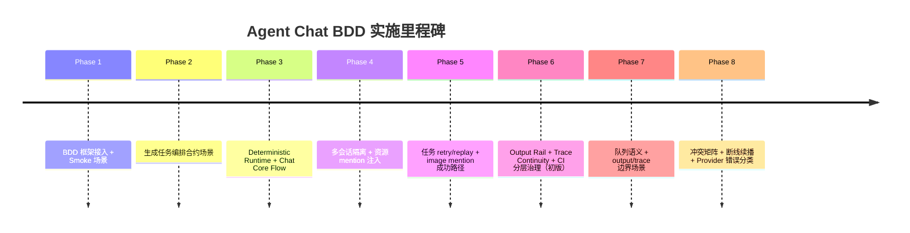

# Agent Chat BDD Phase 视角泳道图（Phase 1 → 8）

更新时间：`2026-02-23`
关联文档：
- 总计划：`docs/specs/agent-chat-bdd-implementation/01-implementation-plan.md`
- 能力映射：`docs/specs/agent-chat-bdd-implementation/02-capability-feature-map.md`

---

## 1) Phase 泳道总览

| Phase | 目标 | 主要产出（Feature / Infra） | 状态 |
|---|---|---|---|
| Phase 1 | 接入 BDD 框架 | `session-management.feature`、`error-recovery.feature`、`fixtures.ts`、`workspace.steps.ts` | ✅ |
| Phase 2 | 生成编排 API 合约 | `generation-tasks.feature`、`project-generation.steps.ts` | ✅ |
| Phase 3 | Chat Core 可控验证 | `chat-core-flow.feature`、deterministic runtime（`deterministic-runtime.ts`） | ✅ |
| Phase 4 | 并发隔离 + 资源上下文 | `multi-session-parity.feature`、`resource-context.feature` | ✅ |
| Phase 5 | 任务恢复与重放 | `task-recovery.feature`、`sqlite-db.ts` 数据注入能力 | ✅ |
| Phase 6 | 可观测与治理固化（初版） | `output-rail-consistency.feature`、`agent-trace-continuity.feature`、CI 分层 + PR/需求模板 | ✅ |
| Phase 7 | 边界与队列语义增强 | `chat-queue-semantics.feature` + output/trace 边界场景并入现有 feature | ✅ |
| Phase 8 | 冲突矩阵 + 断线续播 + Provider 分类 | `turn-conflict-matrix.feature`、`session-reconnect-continuity.feature`、`provider-error-taxonomy.feature` | ✅ |

---

## 2) 里程碑轨迹（时间线）

---

## 3) 每个 Phase 对应的“防回归价值”

- **Phase 1**：保证 Chat 工作台最基础可用性（会话与错误反馈）。
- **Phase 2**：锁定生成链路 API 合约，不因实现重构破坏编排语义。
- **Phase 3**：用可控 runtime 稳定验证 turn/queue/abort 核心控制流。
- **Phase 4**：防止并发串线，保障 mention 上下文进入 runtime。
- **Phase 5**：保障失败可恢复（retry/replay），降低工作流中断成本。
- **Phase 6**：补齐可观测一致性（outputs/trace），并沉淀团队流程约束。
- **Phase 7**：把边界与负向路径（queue 优先级、重复 cursor、空 turnId）纳入回归门禁。
- **Phase 8**：将冲突矩阵、断线续播与 Provider 失败分类沉淀为可执行契约。

---

## 4) 进入下一轮的建议泳道

1. **失败分支加密度**：优先补 `output-rail` 与 `trace` 异常分支。
2. **稳定性泳道**：持续统计 flaky case，周维度清理。
3. **需求入口泳道**：新需求必须先落到 `feature-intake-with-bdd.md`。
